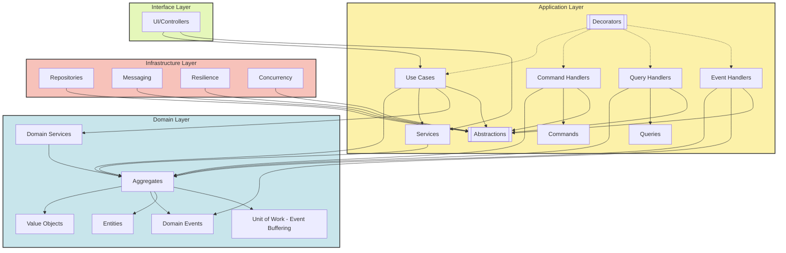

# Jewel Architecture
Jewel Architecture is a fusion of DDD, CQRS, and Clean Architecture—a pattern that leverages their individual strengths to **create scalable, maintainable, and valuable systems.**
I call it Jewel Architecture because it organizes your system into multifaceted, interchangeable components, creating a highly valuable and mantainable structure—like a finely cut gem.
Furthermore, Jewel Architecture leverages the usage of the Unit Of Work (UOW) pattern: this implementation includes buffering and dispatching of aggregate events to **preserve the domain logic's purity** while ensuring consistency in persistence and event publishing.

## Architectural Diagram


## Foundation Principles
**0. Grounded in SOLID principles:** Single Responsibility, Open/Closed, Liskov Substitution, Interface Segregation, and Dependency Inversion.

**1. The Domain is Central:** It is self-contained and free from dependencies.

**2. The Application Layer Supports the Domain:** Its role is to provide the domain with the necessary context and data for business decisions.

**3. Commands Drive Change:** Any action that modifies the system's state is encapsulated in a Command.

**4. Queries Provide Insight:** Reading and retrieving data from the system is handled through Queries.

**5. Cross-Cutting Concerns are Extensible:** Decorators are a clean and flexible way to manage these concerns.

**6. Focused Interaction:** The application layer exposes Use Cases or Services, offering clear entry points for the interface layer.
  
## Examples
This repository showcases solutions structured using the Jewel Architecture, including a simplified **Smart Charging** domain. The core domain invariant ensures that a Group capacity remains valid across all related Charge Stations and Connectors.
Or even a fun version of the **Pokédex**, where under certain conditions, the description of a Pokémon is translated into Yoda's or Shakespeare's language.
The examples use the solution **JewelArchitecture.Core as a base** to implement the specific domain logic. The example projects mirror the structure of the core with the 4 layers: Application, Domain, Interface and an optional Infrastructure level.

## Solution Structure
The solutions use an aggregate-based folder structure and follows a clean architecture, with the following key layers:

**- Application Layer:** Contains use cases, services and business logic.

**- Domain Layer:** Defines entities, aggregates, value objects, invariants and domain logic.

**- Infrastructure Layer:** Optional infrastructure components (in-memory database used here).

**- Interface Layer:** ASP.NET Core Web API exposing application endpoints.

## Customization
- If you need to implement **cross-cutting concerns** like logging, auditing, exceptions handling: Decorators for Commands, Queries or Use Cases are a clean and flexible way to manage these concerns.

- If you need to go **full async with CQRS**: It is enough to write Commands in a queue and then move the handlers in a separate background process or dedicated worker that processes them asynchronously. Also, queries can go full async as well, if you expect long time processing. That would require a response location, like an endpoind dedicated for polling the result or a push notification mechanism.

- If you need to manage **domain events** in a **loosely coupled** and persistent way: You can publish them in a message bus and let the subscribers handle them. Therefore, in that case consider replacing the in-memory event dispatcher with a Pub/Sub external dependency and move the domain event handlers to specific subscriber components. 

- If you need to add persistent storage, transactional support or external dependencies in the future, consider replacing the in-memory repository with another database implementation, adding external services, or configuring additional infrastructure components.

## Running the Examples - Prerequisites
- [.NET 8 SDK](https://dotnet.microsoft.com/download/dotnet/8.0) installed on your machine

## Getting Started

### 1. Clone the repository

Clone this repository to your local machine:

```bash
git clone https://github.com/emanuelebuldrini/jewel-architecture.git
cd Examples/[ExampleProjectName]
```
### 2. Build the Solution
Use the .NET CLI to restore and build the solution:
```bash
dotnet build
```
### 3. Run the Application
Run the application using the .NET CLI.
```bash
dotnet run --project "./JewelArchitecture.Examples.[ExampleProjectName].Interface/JewelArchitecture.Examples.[ExampleProjectName].Interface.csproj"
```

### 4. Test the Application
To run tests for the application, use:
```bash
dotnet test
```
## Example-Specific Details

### Smart Charging
This is an ASP.NET Core Web API project built with .NET 8. The API is configured with Swagger for API documentation and uses an in-memory database, so **no external dependencies** are required.
To run this example, navigate to the folder:

```bash
cd Examples/SmartCharging
```

And run the following command:

```bash
dotnet run --project "./JewelArchitecture.Examples.SmartCharging.Interface/JewelArchitecture.Examples.SmartCharging.Interface.csproj"
```

Once running, you can access the Swagger API documentation at:

HTTP: http://localhost:5253/swagger

### Fun Pokédex
This is an ASP.NET Core Web API project built with .NET 8. The API is configured with Swagger for documentation and **depends on external APIs**, requiring an active internet connection.
To run this example, navigate to the folder:

```bash
cd Examples/FunPokedex
```

And run the following command:

```bash
dotnet run --project "./JewelArchitecture.Examples.FunPokedex.Interface/JewelArchitecture.Examples.FunPokedex.Interface.csproj"
```

Once running, you can access the Swagger API documentation at:

HTTP: http://localhost:5046/swagger

## About Jewel Architecture Project

This project explores an architecture designed to address complex software problems, developed in my own time using personal resources. It offers an opportunity to share ideas and contribute to the broader software engineering community.

While this project reflects my passion for architecture and design, it is entirely separate from my professional work and is neither affiliated with nor endorsed by any employer.

## 💬 Share Your Feedback

Thank you for exploring **Jewel Architecture**! Your thoughts, suggestions, and ideas are invaluable in shaping this approach. Whether you’re trying it out, have questions, or want to propose improvements, I’d love to hear from you.

Feel free to join the conversation in the **[Discussions](https://github.com/emanuelebuldrini/jewel-architecture/discussions)** section of this repository. Here are some ways you can contribute:

- 💡 Share your thoughts on the principles and implementation of Jewel Architecture.
- 🛠 Suggest improvements or enhancements.
- 🧪 Discuss real-world scenarios or use cases where this architecture might shine.
- ❓ Ask questions if you’re curious or need clarification.

  Furthermore, if you have suggestions, questions, or issues and prefer not to use GitHub Discussions, feel free to reach out to me directly:

- **Email:** <a href="mailto:jewelarchitecture.feedback@gmail.com">jewelarchitecture.feedback@gmail.com</a>

I aim to respond within 24 hours whenever possible. If you like what I'm doing, consider watching and starring the repository to stay updated on the latest improvements. It also helps make the project more discoverable to the community. I value every contribution and look forward to engaging with the software engineering community! 


